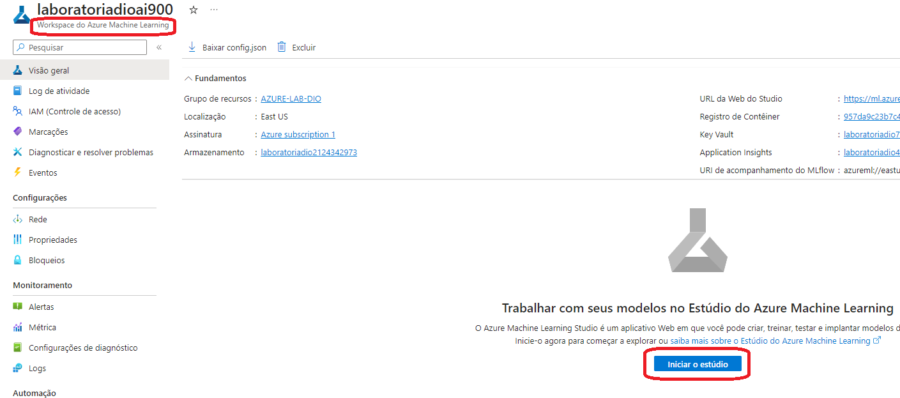
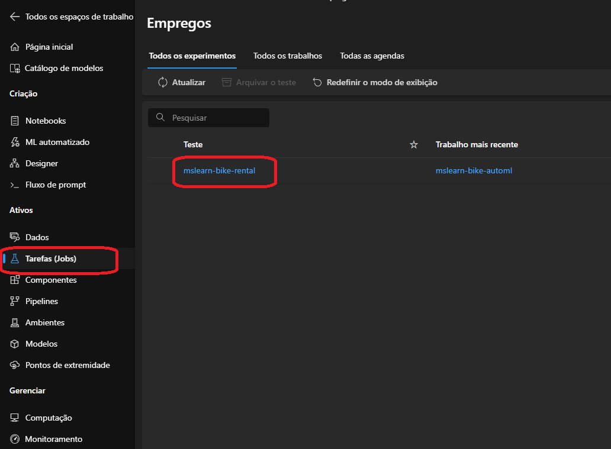
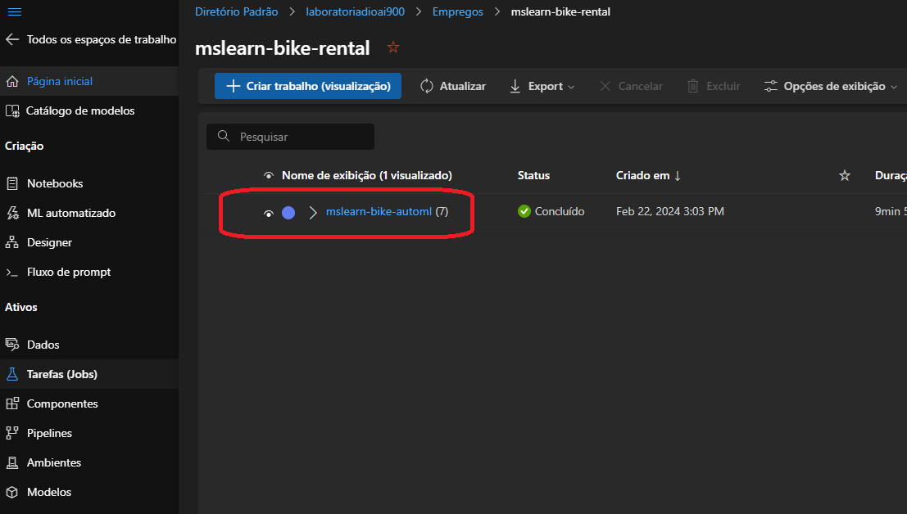
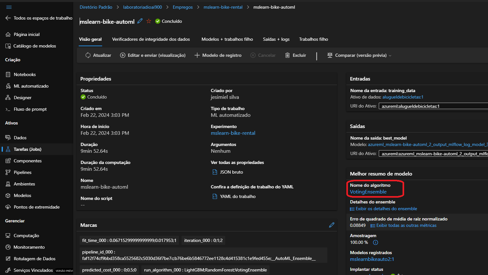
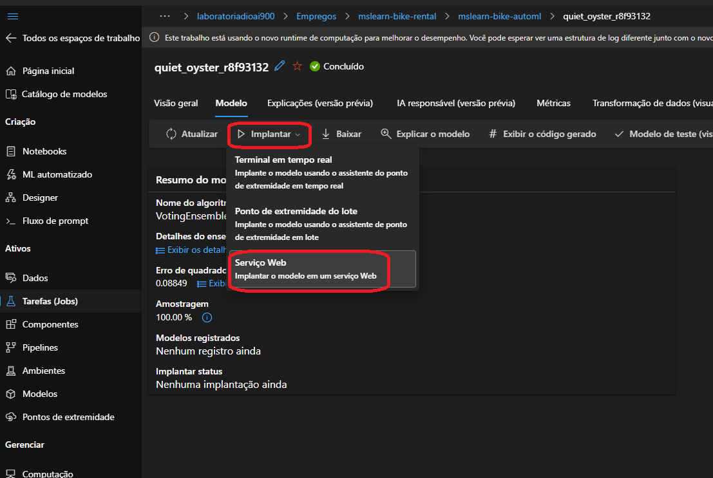
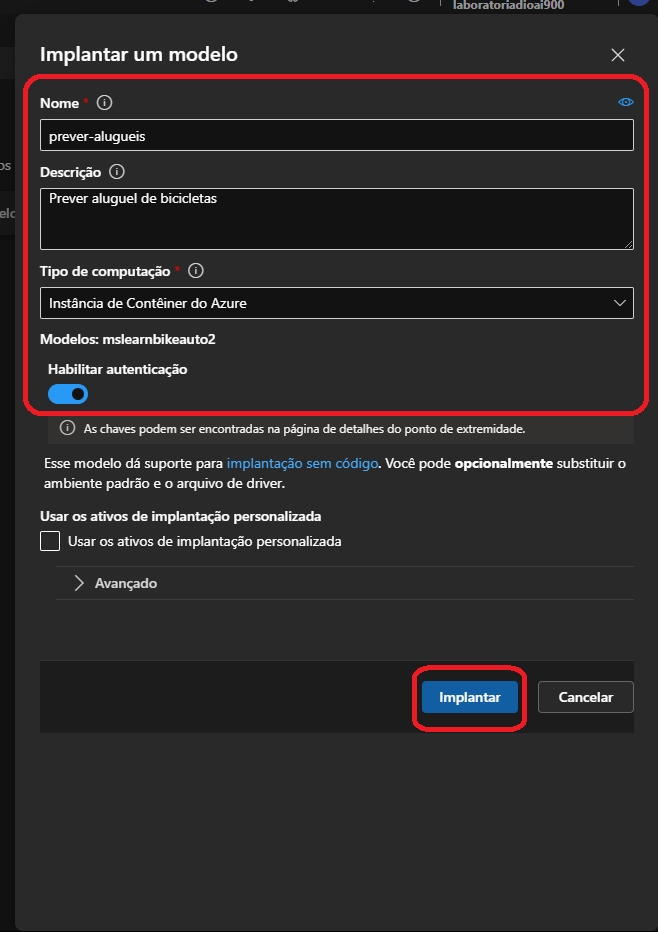
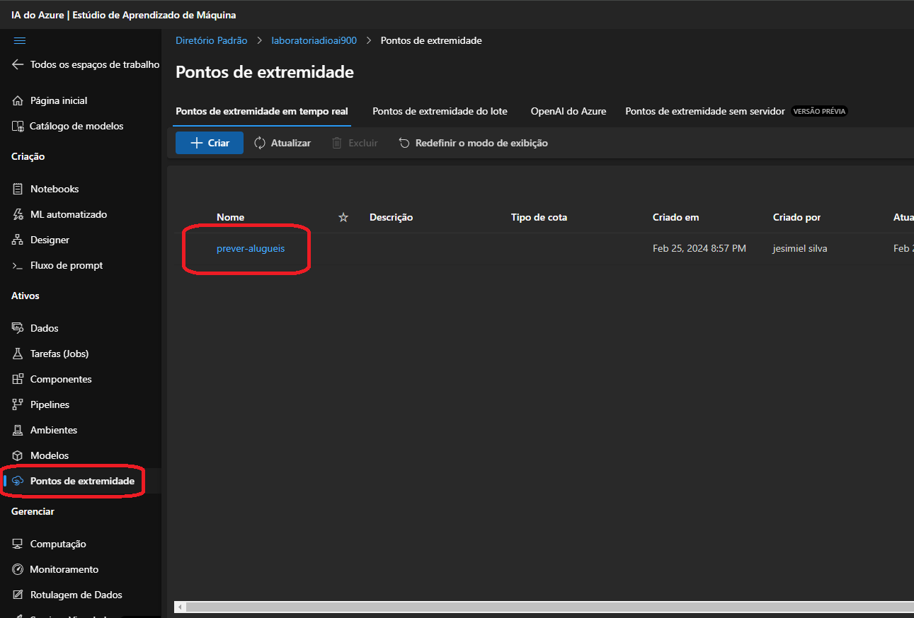
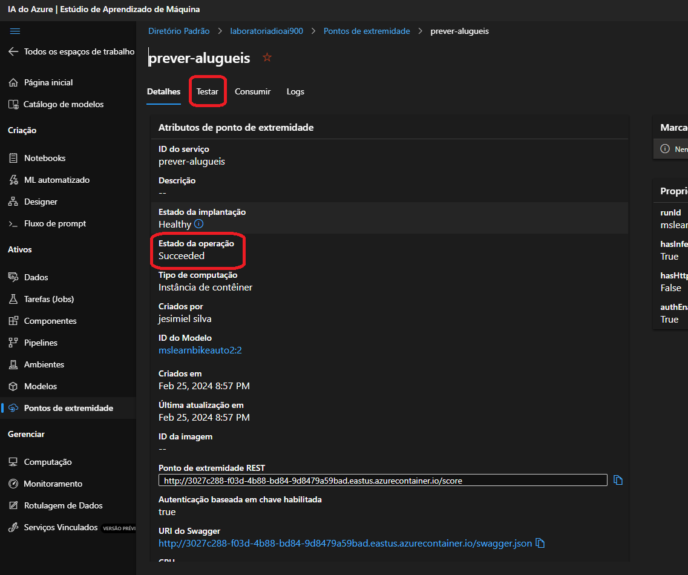
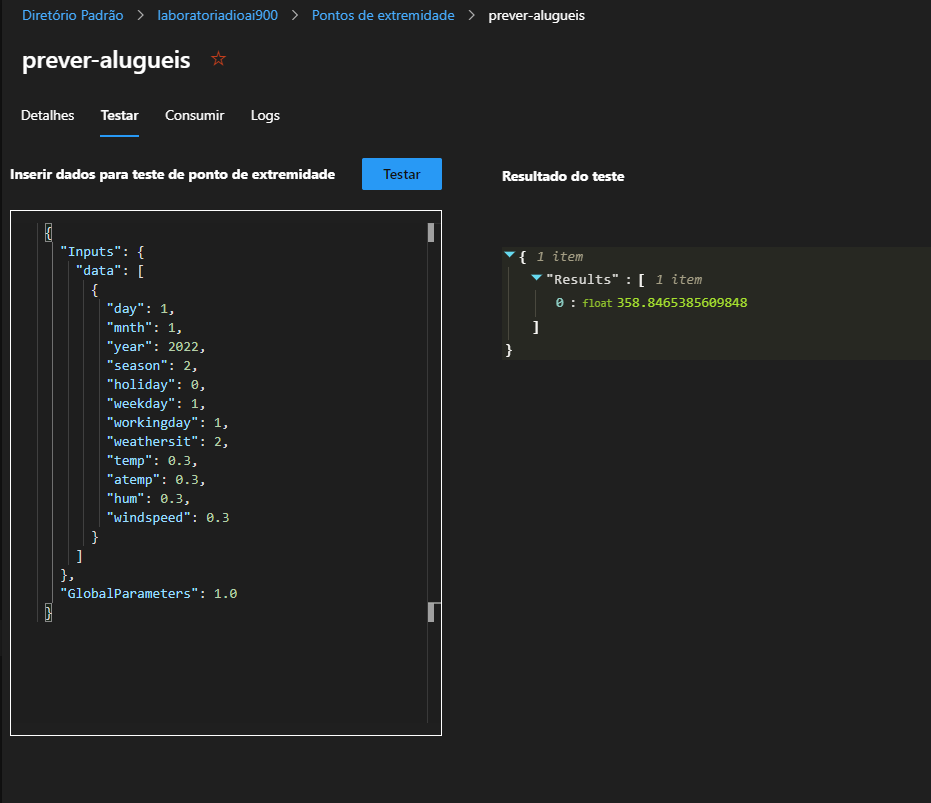

# Guia de Uso do Modelo de Previsão

Este guia fornece instruções passo a passo para criar um modelo de previsão e configurar o serviço web correspondente usando o Azure Machine Learning.

## Criando Modelo de Previsão e Configurando

1. Dentro do seu workspace do Azure Machine Learning, inicie o Estúdio.

   

2. Navegue até as tarefas e abra a job que estiver criada.

   

3. Abra a job concluída.

   

4. Clique no nome do algoritmo.

   

5. Em seguida, clique em "Implementar e Serviço Web".

   

6. Preencha os campos necessários e clique em "Implementar".

   

7. Após concluído, vá para "Pontos de Extremidade".

   

8. Abra o endpoint e certifique-se de que esteja completo, e vá para a aba "Testar".

   

9. Agora é só testar o endpoint.

   

